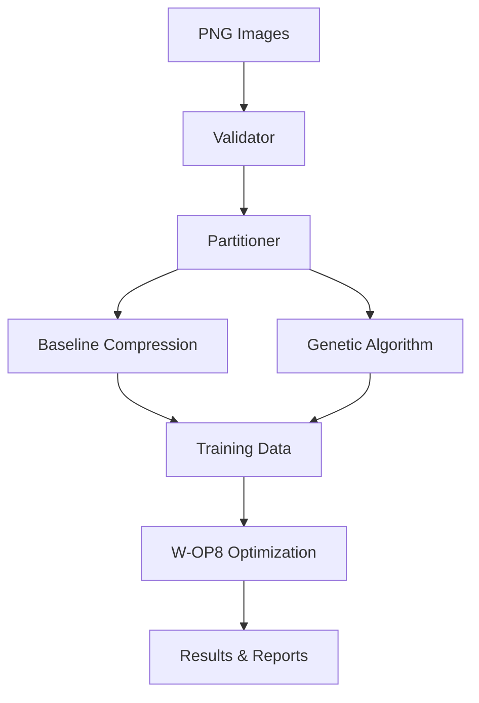

## Demonstrations


# W-OP8: Weight-Optimized JPEG XL Compression

[](https://opensource.org/licenses/MIT)
[](https://www.python.org/downloads/)
[](https://github.com/xavierhillroy/libjxl-wop8/actions)

W-OP8 (Weight-Optimized JPEG XL with 8 Predictors) enhances JPEG XL's lossless compression by optimizing predictor weights through genetic algorithms. This system expands the Weighted Average Predictor from 4 to 8 sub-predictors and automatically discovers optimal weight configurations for different image types.

## 🎯 Key Features

- **🧬 Genetic Algorithm Optimization**: Automatically discovers optimal predictor weights for your specific image datasets
- **📊 Comprehensive Performance Tracking**: Detailed Excel reports with multi-sheet analysis and summary comparisons
- **🖼️ Multi-Domain Support**: Optimized for photography, medical imaging, and document compression
- **💻 Interactive Text UI**: User-friendly terminal interface with real-time progress tracking
- **📈 Reproducible Results**: Seed-controlled experiments with complete parameter tracking
- **🔍 Automatic Validation**: Built-in PNG validation and error handling

## 📈 Performance Overview

W-OP8 achieves consistent compression improvements across diverse image types:

| Image Type     | Average Improvement | Range          |
|----------------|--------------------:|---------------:|
| Photography    | 1.20%               | 0.64% - 2.37%  |
| Medical (US)   | 2.44%               | 1.89% - 2.98%  |
| Documents      | 2.56%               | 2.56% - 2.56%  |

*Results from thesis evaluation across 7 diverse datasets*

## 🚀 Quick Start

### One-Line Installation

```bash
git clone https://github.com/xavierhillroy/libjxl-wop8.git && cd libjxl-wop8 && ./setup.sh
```

### Running Your First Optimization

```bash
# 1. Add your dataset
mkdir W-OP8/data/input/my_images
cp /path/to/your/images/*.png W-OP8/data/input/my_images/

# 2. Run W-OP8
cd W-OP8
python3 main.py
```

## 📋 Prerequisites

### System Requirements
- **OS**: Linux (Ubuntu 20.04+) or macOS (10.15+)
- **Memory**: Minimum 8GB RAM (16GB recommended for large datasets)
- **Storage**: ~5GB for build files, additional space for your datasets
- **Processor**: Multi-core recommended for faster GA optimization

### Required Software
- Git
- Python 3.8+
- C++ compiler (GCC/Clang)
- CMake 3.10+
- Ninja build system

### Installing Prerequisites

**Ubuntu/Debian:**
```bash
sudo apt-get update
sudo apt-get install -y git python3 python3-pip build-essential cmake ninja-build \
    libjpeg-dev libpng-dev
```

**macOS:**
```bash
# Install Homebrew if not already installed
/bin/bash -c "$(curl -fsSL https://raw.githubusercontent.com/Homebrew/install/HEAD/install.sh)"

# Install requirements
brew install git python cmake ninja jpeg libpng
```

## 🛠️ Installation

### Automated Setup (Recommended)

```bash
# Clone the repository
git clone https://github.com/yourusername/libjxl-wop8.git
cd libjxl-wop8

# Run the setup script
./setup.sh
```

This script will:
1. Install JPEG XL dependencies
2. Build the JPEG XL library with W-OP8 modifications
3. Set up the Python environment
4. Create necessary directory structure

### Manual Setup

If you prefer more control over the installation:

```bash
# 1. Install JPEG XL dependencies
./deps.sh

# 2. Build JPEG XL
./build_jxl.sh

# 3. Set up W-OP8 Python environment
cd W-OP8
pip3 install -r requirements.txt

# 4. Create directory structure
mkdir -p data/{input,output/{compressed,spreadsheets,stats},training,testing}
```

## 📖 Usage Guide

### Interactive Mode (TUI)

The easiest way to use W-OP8 is through the interactive text interface:

```bash
cd W-OP8
python3 main.py
```

The TUI will guide you through:
1. Dataset selection
2. Parameter configuration
3. Real-time optimization progress
4. Results visualization

### Command Line Interface

For automation and scripting:

```bash
# Basic usage
python3 src/core/processor.py --dataset my_images

# Full parameter specification
python3 src/core/processor.py \
    --dataset my_images \
    --train-ratio 0.15 \
    --max-train 15 \
    --population-size 50 \
    --generations 30 \
    --mutation-rate 0.07 \
    --crossover-rate 0.85
```

### Parameter Reference

| Parameter | Description | Default | Recommended Range |
|-----------|-------------|---------|-------------------|
| `--dataset` | Dataset directory name | Auto-detect | N/A |
| `--train-ratio` | Training set percentage | 0.1 | 0.1 - 0.2 |
| `--max-train` | Max training images | 10 | 10 - 20 |
| `--seed` | Random seed | 42 | Any integer |
| `--population-size` | GA population | 30 | 20 - 50 |
| `--generations` | GA generations | 24 | 20 - 40 |
| `--mutation-rate` | Mutation probability | 0.05 | 0.01 - 0.1 |
| `--crossover-rate` | Crossover probability | 0.9 | 0.7 - 0.95 |
| `--elitism-count` | Elite individuals | 2 | 1 - 5 |
| `--tournament-size` | Tournament size | 3 | 2 - 5 |

## 📊 Understanding Results

### Output Structure

```
W-OP8/data/output/
├── spreadsheets/
│   └── {run_name}_results.xlsx       # Multi-sheet analysis
├── stats/
│   ├── {run_name}_ga_results.json    # GA convergence data
│   ├── {run_name}_best_weights.json  # Optimal weights
│   └── {run_name}_wop8_results.json  # Final metrics
└── compressed/
    └── {run_name}/
        ├── baseline/                 # Original JPEG XL
        ├── wop8/                     # Optimized compression
        └── ga_candidates/            # Intermediate results
```

### Excel Spreadsheet Breakdown

The results spreadsheet contains four sheets:

1. **Training**: GA evaluation data for each weight configuration
2. **Testing**: Final performance comparison on held-out data
3. **All Images**: Combined results for complete dataset
4. **Summary**: Key metrics and improvement percentages

### Run Naming Convention

All outputs use a standardized naming format that includes all parameters:

```
{dataset}_tr{train_ratio}_max{max_train}_p{pop_size}_g{generations}_m{mutation_rate}_x{crossover_rate}_e{elitism}_t{tournament}
```

Example: `kodak_tr0.1_max10_p30_g24_m0.05_x0.9_e2_t3`

## 🔧 Advanced Configuration


### Batch Processing

Create a batch script for multiple datasets:

```bash
#!/bin/bash
# batch_optimize.sh

datasets=("nature_photos" "ultrasound_abdominal" "handwritten")

for dataset in "${datasets[@]}"; do
    echo "Processing $dataset..."
    python3 src/core/processor.py --dataset "$dataset" \
        --train-ratio 0.15 \
        --generations 30
done
```

### Performance Tuning

For large datasets or limited resources:

```bash
# Faster optimization (fewer generations) 
python3 src/core/processor.py --dataset large_dataset \
    --generations 15 \
    --population-size 20

# More thorough optimization
python3 src/core/processor.py --dataset important_dataset \
    --generations 40 \
    --population-size 50
```

## 🔬 Technical Details

### Architecture Overview



### Predictor Enhancements

W-OP8 extends JPEG XL's original 4 predictors with 4 additional predictors:

1. **Adaptive MED**: Error-correcting Median Edge Detector
2. **Adaptive Median**: Context-aware median predictor
3. **Paeth**: PNG-style predictor optimized for edges
4. **GAP-based**: Gradient-adjusted prediction with edge detection

### Genetic Algorithm Details

- **Chromosome**: 8 integer weights (0-15)
- **Selection**: Tournament selection (size 3)
- **Crossover**: Uniform crossover (90% rate)
- **Mutation**: Per-gene mutation (5% rate)
- **Elite Preservation**: Top 2 individuals per generation

The project includes an interactive visualization of the genetic algorithm used for optimization. 
See [demos/ga_animation.html](./W-OP8/demos/ga_animation.html) for an interactive step-by-step walkthrough of the GA process.

## 🔍 Troubleshooting

### Common Issues

**1. Build Failures**
```bash
# Clean and rebuild
rm -rf build
./build_jxl.sh
```

**2. Python Import Errors**
```bash
# Verify Python dependencies
cd W-OP8
pip3 install -r requirements.txt --upgrade
```

**3. "No datasets found" Error**
```bash
# Check directory structure
ls -la W-OP8/data/input/
# Ensure your dataset folder exists with PNG files
```

**4. Memory Issues During GA**
```bash
# Reduce population size and generations
python3 src/core/processor.py --dataset small_dataset \
    --population-size 15 \
    --generations 10
```

### Debug Mode

Enable verbose output for troubleshooting:

```bash
export PYTHONPATH=.
python3 -v src/core/processor.py --dataset debug_dataset
```


### Getting Help

If you're stuck:
1. Check if there are similar issues in the [GitHub Issues](https://github.com/xavierhillroy/libjxl-wop8/issues)
2. Create a new issue with:
   - Your OS (Linux/macOS)
   - Python version (`python3 --version`)
   - Complete error message
   - What you were trying to do

## 📚 Documentation


- **This README**: Complete setup and usage guide
- **[Complete System Documentation](./W-OP8/docs/W-OP8_System_Documentation.md)**: Technical details and architecture
- **[Thesis Paper](./W-OP8/docs/Hill_Roy_Xavier_FInal_Thesis_Report.pdf)**: Academic research paper
- **Code Comments**: Detailed explanations within the source code


## 🤝 Contributing

This is a research project from my undergraduate thesis. While not actively seeking contributions, if you'd like to suggest improvements:

1. Fork the repository
2. Create a feature branch (`git checkout -b feature/improvement`)
3. Make your changes
4. Submit a pull request with a clear description

Please note this is primarily an academic project, so major changes may not be accepted.


### Development Setup

```bash
# Clone and set up development environment
git clone https://github.com/yourusername/libjxl-wop8.git
cd libjxl-wop8
./setup_dev.sh

# Run tests
cd W-OP8
python -m pytest tests/

# Format code
black src/
```
## 📄 License

This project contains two licensed components:

### W-OP8 Modifications
All W-OP8 modifications and additions (everything in `W-OP8/` directory and related enhancements) are licensed under the **MIT License** - see [LICENSE](LICENSE_WOP8) file.

### JPEG XL Base Library
The original JPEG XL code retains its **BSD 3-Clause License** - see [LICENSE](LICENSE) file (the one you found).

### License Compatibility
Both licenses are compatible and permissive. The MIT License (for W-OP8) and BSD 3-Clause License (for JPEG XL) allow free use, modification, and distribution with proper attribution.


## 🙏 Acknowledgments

- **Supervisor**: Mahmoud El-Sakka, Western University
- **Course Instructor**: Nazim Madhavji, Western University  
- **JPEG XL Project**: For the foundational codec implementation
- **Western University Computer Science Department**: For research support
## 📞 Contact & Support

- **Author**: Xavier Hill Roy
- **Email**: [xavierhillroy@gmail.com]
- **Project**: [https://github.com/xavierhillroy/libjxl-wop8](https://github.com/xavierhillroy/libjxl-wop8)

## 📚 Citation

If you use W-OP8 in your research, please cite:

```bibtex
@thesis{hillroy2025wop8,
  author = {Xavier Hill Roy},
  title = {W-OP8: Enhancing JPEG XL's Lossless Compression through 
           Genetic Algorithm-Optimized Predictor Weights},
  school = {Western University},
  year = {2025},
  type = {Undergraduate Thesis},
  url = {https://github.com/xavierhillroy/libjxl-wop8}
}
```

---

<p align="center">
  Undergraduate Thesis Project - Xavier Hill Roy<br>
  Western University Computer Science Department, 2025
</p>
